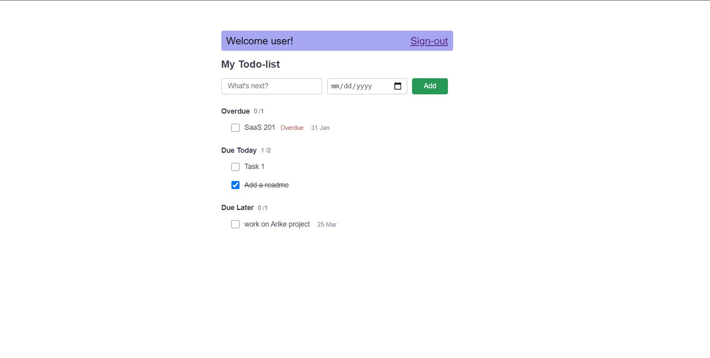

# Todo Manager

#### URL to the website
[Todo Manager app Link](http://amit-todo-manager-saas-201.herokuapp.com/)

#### Credentials
* email :=> user@todo.com
* password :=> 123

### This is a todo manager built on `Rails`
It has
* Login/Sigup functionality
* Can add todo
* Remove a todo
* Mark todo as Done

### This app categorises your Todo in three categories
* Overdue
* Due Today
* Due Later

